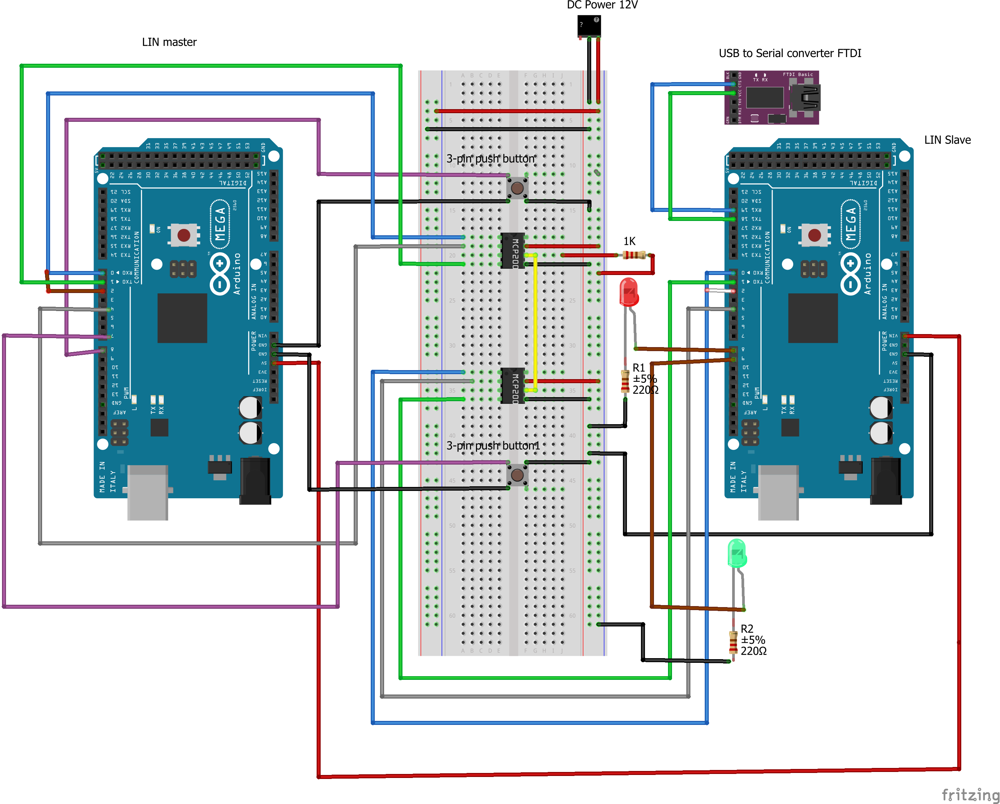
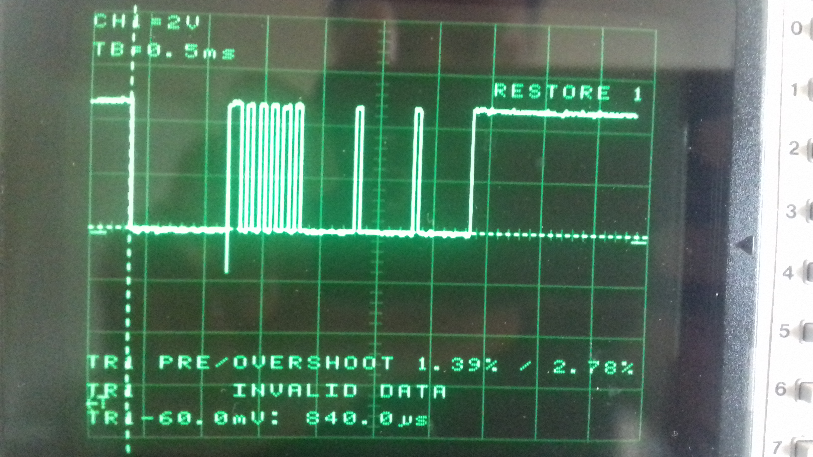

# Two-node LIN bus cluster   
By Pedro Fernandez Acuna
fernpedro@gmail.com

## Introduction
Here follows a brief description of an Arduino based LIN bus network using Arduino Mega 2560 and Microchip MCP2003 transceiver. I have done some research, did some test to verify and clarify to myself and capture the info for later reference. The description covers the basics of LIN bus, how to wire up a two-node LIN bus, its wiring diagram as well as practical tips for its implementation.

It is worth noting that here we only consider the standard slave-to-master communication, where the master broadcasts the identifier to the network and one slave responds with a data payload. 
## Arduino based LINB bus set-up
According to MCP2003 datasheet, the LIN transceiver should be powered with 12V external power supply. On the other hand, the Arduino mega 2560 Master breadboard is powered with 5V from the PC’s USB port to get started. To avoid what is called a “ground loop”, which occurs when the grounds are not at the same potential level (which in turn causes a current to flow from one point in the circuit to the other) the LIN transceiver and the Arduino Mega must share a common GND line.

The Arduino Slave is powered via its Vin pin from the 5V power pin on Arduino Master using jumper vires, so when we plug the Arduino master, it also powers the Arduino Slave. The attached Fritzing diagram (Fig 1), shows the physical hookup of the Arduino based LIN bus.

All nodes (MCP2003 transceivers) have a 30K built in pull-up resistor (Microchip MCP 2003 block Diagram page 2). It ensures that the bus level matches the 12V DC power supply (LIN bus idles HIGH) when the Tx in all nodes are in the off state. So, what turns a node into a Master is just the externally attached 1K pull-up resistor. Fig. 1.

There are two push buttons from Keyes in the LIN bus setup. Each button has a 10K resistor built in and three pins: GND, Vcc and Data. The pin Data on the push button is wired up to the digital pin 8 on the Arduino Master. When the push button is unpressed (open), the pin 8 on the Arduino Master is pulled up to 5V through the Arduino internal pull-up resistor by doing:  pinMode(push-button, INPUT_PULLUP). This will make the Vcc pin free. Fig. 1.

Since LIN buss is a one wire bidirectional half duplex bus, we can’t drive Tx and Rx at the same time. We can send frames from one device to another but while this is happening, no other device can use the bus. As a result, the connection between the Arduino Mega and the transceiver MCP2003, for both Master and Slave, should be uncrossed: Tx to Tx and Rx to Rx. Fig. 1.

The actual data transfer is done on Hardware serial. For debugging purposes, we use the Software serial port serial1, Rx1(18) and Tx1(19), on the Arduino Mega Slave. To read the debug message from the Arduino Mega Slave, a USB to serial converter (FTDI) is connected to serial1 port. Then we use a serial terminal program called Terminal v1.93b to display the message. PuTTy also works fine but I prefer Terminal v1.93b by Bra@y++. 

In contrast to the straight connection between the Arduino board and the transceiver, the connection between the serial1 on the Arduino Mega Slave and the USB to serial connector (FTDI) should be crossed. Consequently, pin TxD on the FTDI goes to Rx1 on serial1 and pin RxD on FTDI goes to Tx1 on serial1 respectively. Fig. 1.

The red LED is attached to pin 8 on Arduino Mega slave. It will flash to indicate that we are having some communication on the LIN bus.

Fig.1 Setting up pf Arduino based LIN bus

##Implementation
There are two different sketches, one for the Master and one for the Slave. We need o upload each sketch to respective Arduino. We start by uploading the Slave sketch first and then the Master sketch. We need to make sure that different Arduino serial ports on the Arduino IDE are assigned to them. 

As mentioned above, we need to power the transceiver MCP2003 with 12V and provide GND to get it running. Now to enable the LIN transmitter we need drive the CS pin HIGH. At the beginning, we can ignore the Vren and WAKE pins. The LIN bus will work without them.

Collision avoidance is a big issue in LIN bus protocol. Since LIN protocol is a half-duplex serial communication protocol, we can’t drive Tx and Rx at the same time.  LIN bus uses a technique where each Slave monitors the bus line. As soon as the LIN goes LOW (LIN idles HIGH), it knows the line is busy so knows not send anything. After the line goes HIGH and stays HIGH for more than 10 ms, it knows the line is clear and safely send.

The MCP2003 has no a pin that can flag when the line is busy. So, we need to simulate such a pin with the Arduino. For this purpose, we loop the RXD pin on the transceiver MCP2003 into the interrupt digital pin 0 on Arduino Mega (digital pin 2 in AVR). Every time the RXD pin and therefore the interrupts pin goes LOW, we set a flag that signal that the line is busy.  Here we use the falling edge on RXD to flag that it’s not clear to send and to reset the timer. Then on the rising edge on RXD we start a timer that fires another interrupt after 10ms to flag “clear to send”

Translating it into code we need to use the falling edge on Rx to flag not “clearTosend” and to reset the timer. Then on the rising edge on Rx we start a timer that fires another interrupt after 10ms to flag “clearTosend”.  If the RXD signal falls before the 10ms timer has finished, the timer is reset again. We only get “clearTosend” if RXD stays high for longer than 10ms.  

Another big issue in this project was button debouncing. The pin on Arduino board, to which the button is connected, is normally pulled down LOW and once we press the button it goes to HIGH. What we would expect to happen is that when we press the push button the Arduino is going to read one press of the button. But that is not the case because the buttons are mechanical and they involve springs and metallic contacts. So, one press of the button might give us up to 50 actual contacts and we don’t need that digital read bouncing around 50 times.

So, we need to debounce the push buttons. We can debounce the push buttons in both software and hardware. There are a few ways to do debouncing in software. In this project we will focus on the debounce library that we find the most useful and flexible called Bounce2.  Download it and install into the Arduino IDE. Here is the link to the library: https://github.com/thomasfredericks/Bounce2.  

Another important issue is to come up with a simple message structure that will be send over the LIN bus. Here the 15-bit length Synch Break is the big issue! The frame header ideally would contain, besides the Synch Break, the Synch Byte 0x55 and the PID field. Here we start with a simple frame structure consisting of Synch Break, Synch Byte (0x55) and three data fields. Further information about how the LIN frame was implemented can be founded at “Introduction to LIN”, webinar by Vector, page 21 https://vector.com/portal/medien/cmc/events/Webinars/2014/Vector_Webinar_IntroductionToLIN_20140930_EN.pdf

Fig.2 Screenshot of the Frame Header for LIN bus
Fig.2 shows a screenshot for a LIN header frame consisting of 15-bit length Synchronization break including its delimiter, Synchronization Byte 0x55 and three data bytes of zero value. The Baudrate value is 19200[bits/s], which in turn gives a time bit Tbit  = Baudrate-1 = 52.1 us. 
The Baudrate setting determines not only how fast the data will be transferred but also the size of the Tbit which ultimately shapes the length of the frame.

As can be seen from Fig.2, the simple header frame seems to be very accurate. The theoretical value of the 15-bit dominant Synch Byte (15*Tbit = 800 us) is very close to its corresponding value of 840us as shown the screenshot from the scope. So, now we need just to add the PID field and then calculate the Checksum and add it to the end of the frame. The Slave will do the same calculation on the message it receives and compares the calculated Checksum with the one transmitted. If the match, all it’s fine. If they don’t, we should discard it as it’s corrupt.

The master initiates all communication. We need to come up with a message structure that will be sent on the bus. The message structure would ideally contain the address of the slave, the length of the message (assuming it’s not a fixed length), whatever commands or data you wish to send and finally the checksum.

Once you have built the message, you calculate the checksum and add it to the end of the message. Your slave will do the same calculation on the message it receives and compares the calculated checksum with the one transmitted with the message. If they match, all it’s good. If they don’t you should discard it as it’s corrupt. 

Please read the comments inside the sketches for further description.  Some changes were made during course of development of the project so, the Fritzing diagram might not match the currently setup.

_Note: I add this old project to  Github as it is. I hope that someone can find this guide and example helpful!_

